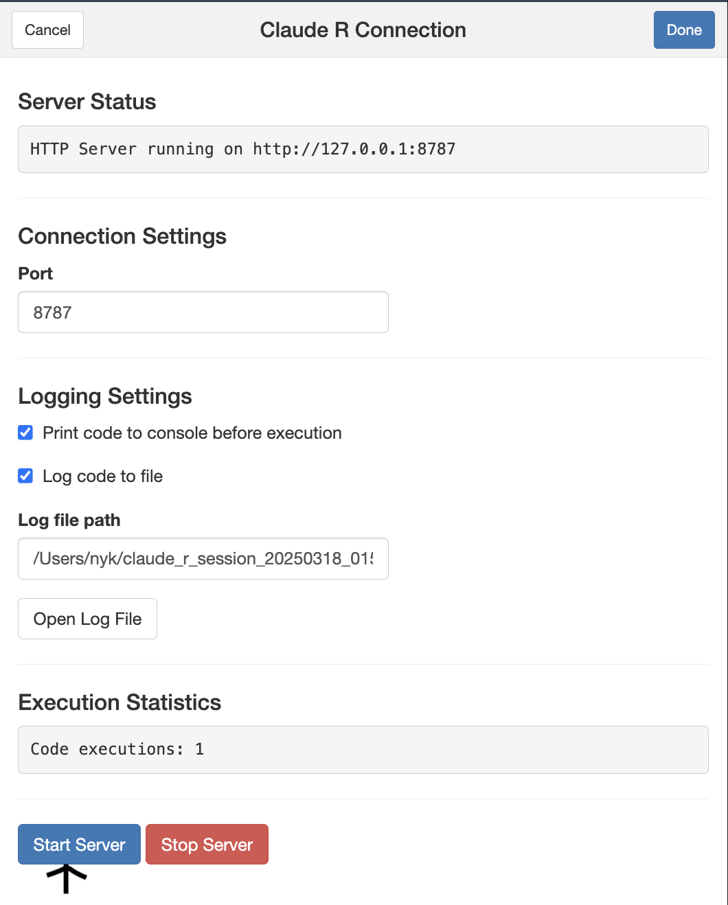

# ClaudeR


- ClaudeR is an R package that creates a direct connection between RStudio and Claude AI, allowing for interactive coding sessions where Claude can execute code in your active RStudio session and see the results in real-time.

- It can explore the data autonomously, or be a collaborator. The choice is yours.

- This will work with Cursor, or any service that allows for MCP servers that has the ability to run R. For Cusor, install the R add-on (R Extension for Visual Studio Code
) and update the MCP file accordingly. You can find this in Cursor > Settings > Cursor Settings > MCP

# Features

Claude has the following MCP tools:
- execute_r – Execute R code and return the output.
- execute_r_with_plot – Execute R code that generates a plot.
- get_active_document – Get the content of the active document in RStudio.
- get_r_info – Get information about the R environment.
- modify_code_section – Modify a specific section of code in the active document.

From these, you are able to do the following:

- Direct Code Execution: Claude can write and execute R code in your active RStudio session (including installing packages)
- Feedback/Assistance: Receive explanations of what your current R script does, and/or ask for edits at specific lines.
- Visualization Creation: Claude can generate, see, and refine plots and visualizations 
- Data Analysis: Claude can analyze your datasets and iteratively provide insights
- Code Logging: All code executed by Claude can be saved to log files for future reference
- Console Printing: Option to print Claude's code to the console before execution
- Environment Integration: Claude can access variables and functions in your R environment

* Note: Claude is able to create Quarto Presentations. I recommend opening an active qmd file and asking for specific updates there. It is not perfect but I am actively working on improving this feature.

# How It Works

- ClaudeR leverages the Model Context Protocol (MCP) to create a bidirectional connection between Claude AI and your RStudio environment. 

- MCP is an open protocol developed by Anthropic that allows Claude to safely interact with local tools and data sources.

In this case:

1. The Python MCP server acts as a bridge between Claude and RStudio
2. When Claude wants to execute R code, it sends the request to the MCP server
3. The MCP server forwards this to the R addin running in RStudio
4. The code executes in your R session and results are sent back to Claude

- This architecture ensures Claude can only perform approved operations through well-defined interfaces while maintaining complete control over your R environment.

Check out the youtube video below for a quick example of what to expect when you use it

[](https://youtu.be/KSKcuxRSZDY)


# Security Restrictions

For security reasons, ClaudeR implements strict restrictions on code execution:

- **System commands**: All `system()` and `system2()` calls are blocked, `shell()`, and other methods of executing system commands.

- **File deletion**: Operations that could delete files (like `unlink()`, `file.remove()`, or system commands containing `rm`) are prohibited.

- **Error messages**: When Claude attempts to run restricted code, the operation will be blocked and a specific error message will be returned explaining why.

## Why These Restrictions Matter

These security measures exist to protect your system from unintended consequences when using an AI assistant:

1. **Data Protection**: While Claude is designed to be helpful, allowing unrestricted system access could potentially lead to accidental deletion or modification of important files.

2. **Controlled Environment**: By limiting operations to data analysis, visualization, and non-destructive R functions, we ensure Claude remains a safe tool for collaboration.

3. **Principle of Least Privilege**: Following security best practices, Claude is given only the permissions necessary to assist with data analysis tasks, not full system access.

4. **Predictable Behavior**: These restrictions create clear boundaries around what actions can be performed automatically versus what requires manual user intervention.

These restrictions only apply to code executed through the Claude integration. Normal R code you, the human, run directly is not affected by these limitations. If you need to perform restricted operations, you can do so directly in the R console. These restrictions are in place to protect you from any unexpected behavior. Claude is generally safe, but it's always better to be safe than sorry.


# Installation
Prerequisites:

For Claude Desktop App use:

1) R 4.0+ and RStudio
2) Python 3.8+ For the MCP server component
3) Claude Desktop App: The desktop version of Claude AI

For Cursor:

1) R Extension for Visual Studio Code
2) Python 3.8+ For the MCP server component

# Step 1: Install R Package Dependencies

Run these inside your RStudio environment. 
```bash
install.packages(c(
  "R6",
  "httpuv",
  "jsonlite", 
  "miniUI",
  "shiny", 
  "base64enc",
  "rstudioapi",
  "devtools"
))
```
# Step 2: Install Python Dependencies

Run this in terminal or command prompt
```bash
pip install mcp httpx
```
# Step 3: Install ClaudeR from GitHub


Run this in your RStudio environment
```bash
devtools::install_github("IMNMV/ClaudeR")
```

# Step 4: Configure Claude Desktop
Locate or create the Claude Desktop configuration json file using terminal or command prompts:
```bash
Mac: cd /Users/YOUR-NAME/Library/Application\ Support/Claude/
Mac: open .
Windows: cd %APPDATA%\Claude
Windows: explorer .
```
If you can't open it, right click > Open with > pick the editor of your choice (text edit, notepad, vscode, xcode, etc.)


Or, via the desktop app, open the Claude desktop App > Click Claude in the top left > Settings > Developer > Edit Config

Add the following to the claude_desktop_config.json file, or in the mcp.json file in the Cursor settings:

```bash
{
  "mcpServers": {
    "r-studio": {
      "command": "python",  # Or full path to your Python executable
      "args": ["PATH_TO_REPOSITORY/ClaudeR/src/clauder/server.py"],
      "env": {
        "PYTHONPATH": "PATH_TO_PYTHON_SITE_PACKAGES",  # Optional if using system Python
        "PYTHONUNBUFFERED": "1"
      }
    }
  }
}
```

Replace
- PATH_TO_REPOSITORY with the path to where the package is installed (use find.package("ClaudeR") in R to locate it)
- PATH_TO_PYTHON_SITE_PACKAGES with the path to your Python site-packages directory

If you using `uv`, you can add the following to the mcp.json file in the Cursor settings:

```json
{
  "mcpServers": {
    "r-studio": {
      "command": "uvx", 
      "args": ["--from", "git+https://github.com/IMNMV/ClaudeR"],
      "env": {
        "PYTHONUNBUFFERED": "1"
      }
    }
  }
}
```

# Finding Your Python Site-Packages Path

To find your Python site-packages path:

1. Open a terminal or command prompt
2. Run this command:
   ```bash
   python -c "import site; print(site.getsitepackages()[0])"
   ```
3. Copy the output path and use it in your configuration

If you're using a virtual environment or conda, make sure to run this command in the correct environment where you installed the dependencies.


# Usage
Starting the Connection

1) Load the ClaudeR package in your RStudio environment and start the addin:

```bash
library(ClaudeR)
claudeAddin()
```

2) In the addin interface:


- Click "Start Server" to launch the connection
- Configure logging settings if desired
- Keep the addin window active while using Claude (you can switch to other views like Files, Plots, Viewers, etc. - just don't hit the stop sign/stop button)

3) Open Claude Desktop and ask it to execute R code in your session

# Logging Options
The ClaudeR addin provides several logging options:

- Print Code to Console: Shows Claude's code in your R console before execution
- Log Code to File: Saves all code executed by Claude to a log file
- Custom Log Path: Specify where log files should be saved

Each R session gets its own log file with timestamps for all code executed. That means all code made from chats will be saved in a single log file until the R session is restarted.

# Example Interactions
Once connected, you can ask Claude things like:

- "I have a dataset loaded in my env named data, please perform exploratory data analysis on it and run relevant statistical analyses"
- "Load the mtcars dataset and create a scatterplot of mpg vs. hp with a trend line"
- "Fit a linear model to predict mpg based on weight and horsepower"
- "Generate a correlation matrix for the iris dataset and visualize it"
- "Create a function to calculate moving averages of a time series"

All in all, if you (a human) can do it with R, Claude can do it with R. Go nuts with it. 

# Important Notes

- Session Persistence: All variables, data, and functions created by Claude remain in your R session even after you close the connection
- Code Visibility: By default, code executed by Claude is printed to your console for transparency
- Port Configuration: The default port is 8787, but you can change it if needed
- Log Files: Each R session gets its own log file when logging is enabled
- Claude can install packages if you ask it to. Be careful with this - good prompting is very important. By default it tends to try other methods if it fails, but telling it what it should or shouldn't do as part of the initial prompt is good practice.

# Troubleshooting

For Connection Issues:

- Make sure Claude Desktop is properly configured
- Check that the Python path is correct in your config file
- Verify that you've started the server in the addin interface
- Try restarting RStudio if the port is already in use
- Most server issues can be solved by restarting the R session. Make sure to save your work before you do. 

For Python Dependency Issues:

- Ensure you've installed the required Python packages: mcp and httpx
- Check that your Python environment is accessible

Claude Can't See Results:

- Make sure the addin is running (the window must stay open)
- Check that the server status shows "Running"
- Verify there are no error messages in the R console

Warnings:

- You may get a warning after installing dev tools, this will not mess with functionality. Bugs still exist, but I will work on fixing them as they arise.


- If you stop the server then re-start it in the same R session, you may see the following:


"Listening on http://127.0.0.1:3071

createTcpServer: address already in use

Error starting HTTP server: Failed to create server"

This is a UI bug. The server is still active, and you can have Claude run code like normal. However, if you run into issues with Claude not being able to connect then the server you will need to restart RStudio.
If this issue causes Claude to not access the R environment please save your work and click the 'Force Kill Server response' in the viewer pane. This will run the kill command on the backend: 

```bash
kill -9 [PID] 
```

This happens because the MCP server is made within the active R Studio session and thus that port is binded to it. So, by forcing this termination it will also terminate RStudio. 


# Limitations

- The addin window must remain open for the connection to work
- Each R session can only connect to one Claude session at a time

# License
MIT

# Contributing

Contributions are welcome! Please feel free to submit a Pull Request.

  
